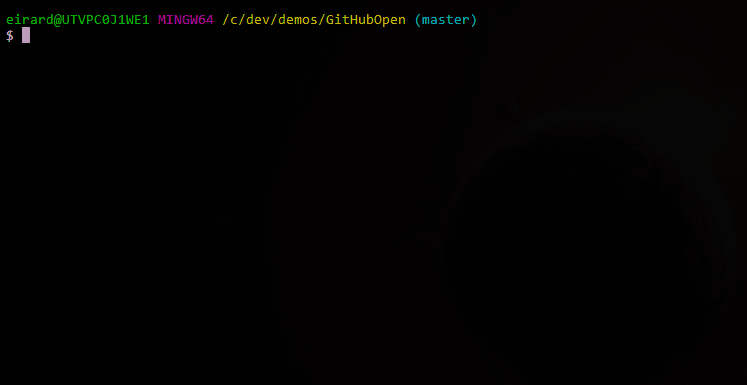

# GitHub Open

_Opens the GitHub page for the Git repository you're working in_



## Install

1. [Download from Releases](https://github.com/eaardal/github-open/releases)
2. Add the directory with the exe to your PATH
3. Use `gho` from a commandline

## Use

If you're currently in a git repository's root directory, you only need to run `gho` with no arguments

```bash
bob@comp /c/git/my-repo
$ gho
> Opening "https://github.com/bob/my-repo"
```

You can also provide a relative path

```bash
bob@comp /c/git
$ gho ./my-repo
> Opening "https://github.com/bob/my-repo"
```

```bash
bob@comp /c/git/my-repo/subdirectory
$ gho ..
> Opening "https://github.com/bob/my-repo"
```

Or be explicit

```bash
bob@comp /c/git/my-repo
$ gho .
> Opening "https://github.com/bob/my-repo"
```

```bash
bob@comp /c
$ gho c:/git/my-repo
> Opening "https://github.com/bob/my-repo"
```

#### `/pulls`

Use additional parameters to open specific sub-pages in GitHub

```bash
bob@comp /c
$ gho c:/git/my-repo prs
> Opening "https://github.com/bob/my-repo/pulls"
```

`prs`, `pull-requests`, and `pulls` are all valid parameters to launch the _Pull Requests_ GitHub page.

You can also specify a PR by its ID:

```bash
bob@comp /c/git/my-repo
$ gho pr=3
> Opening "https://github.com/bob/my-repo/pull/3"
```

`pr={id}`, `pull={id}`, `pr/{id}`, or `pull/{id}` are all valid formats for specifying a PR.

#### `/issues`

Like pull requests, some parameters can be specified to launch the _Issues_ GitHub page.

```bash
bob@comp /c/git/my-repo
$ gho issues
> Opening "https://github.com/bob/my-repo/issues"
```

You can also specify a specific issue by its ID:

```bash
bob@comp /c/git/my-repo
$ gho issue=4
> Opening "https://github.com/bob/my-repo/issue/4"
```

`issue={id}` and `issue/{id}` are both valid formats for specifying an issue.

### Aliases

If you want to be able to use `gho` anywhere, without having to specify a path to a git repo, you can save its path as an alias. Aliases are stored at `%appdata%/GitHubOpen/aliases`.

#### `set-alias`

This will save a new alias. Takes the following parameters:

1. Alias [required]
2. Path on disk [required]
3. Parameters [optional]

```bash
bob@comp /c/somewhere/not/a/git/repo
$ gho set-alias thebestrepo c:/dev/git/my-repo
$ gho thebestrepo
> Opening "https://github.com/bob/my-repo"
```
Now `gho thebestrepo` can be used anywhere and will always launch the GitHub page found in `c:/dev/git/my-repo`.

Also takes additional parameters for deeplinking to issues or PRs as described above.

```bash
bob@comp /c/somewhere/not/a/git/repo
$ gho set-alias thebestissues c:/dev/git/my-repo issues
$ gho thebestissues
> Opening "https://github.com/bob/my-repo/issues"
```

#### `get-aliases`/`aliases`

```bash
bob@comp /c/somewhere/not/a/git/repo
$ gho get-aliases
> Aliases ({PATH-TO-FILE}):
>  Key: thebestrepo
>  Path: c:/dev/git/my-repo
>
>  Key: thebestissues
>  Path: c:/dev/git/my-repo
>  Parameters: issues
```